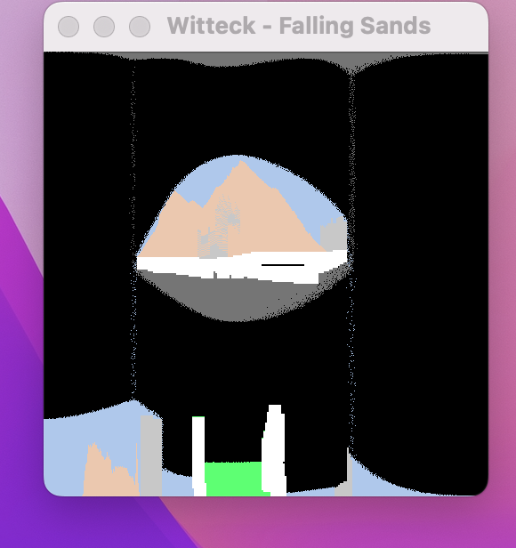
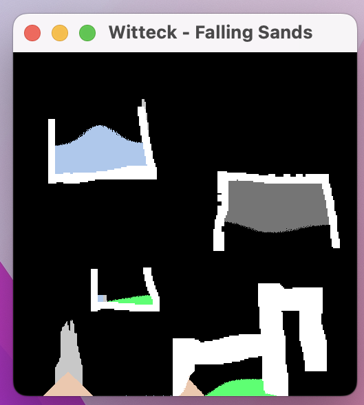
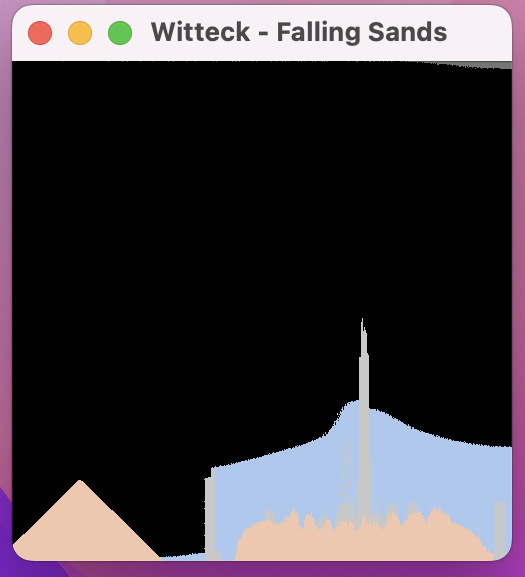

## [Screenshots]

  
  
  
  
  
  

## [Description]

For this game, I created a Falling Sands game. It has 7 elements: sand, water, stone, smoke, acid, block, and lava. Each element behaves differently, and can interact with each other. You are able to toggle these elements by pressing numbers 1-8, then place them on the screen by clicking. You can toggle an eraser by pressing 7, and you can wipe the screen by pressing the 'r' key. You can even increase/decrease your pen size by pressing '\[' and '\]' respectively. 

## [Inspiration & Help]
This was originally a final project for one of my classes but has been vastly overhauled and improved upon.
* *(https://www.youtube.com/watch?v=5Ka3tbbT-9E)*
* *(https://www.youtube.com/watch?v=VLZjd_Y1gJ8)*
* *(https://blog.winter.dev/2020/falling-sand-games)*

## [How to Compile and Run]

For this game, you will need to install SFML, which can be found here: (https://www.sfml-dev.org/tutorials/2.5/start-linux.php). After that is installed, clone the repository and navigate to the part1 directory. From there, using 'make all' will compile the project, and './prog' will run the project. Using 'make clean' will delete the binary file. 

To play the game, you will need to press the key corresponding to an element. These are toggle buttons, so pressing a number once preserves your choice until you make another key press. Once a button is pressed you can begin to click and hold where you would like to place your elements. All key bindings are as follows:

1 - Sand

2 - Water

3 - Stone

4 - Smoke

5 - Acid

6 - Block

7 - Eraser

8 - Lava

r - Resets the screen

\[ - Decreases pen size

\] - Increases pen size
